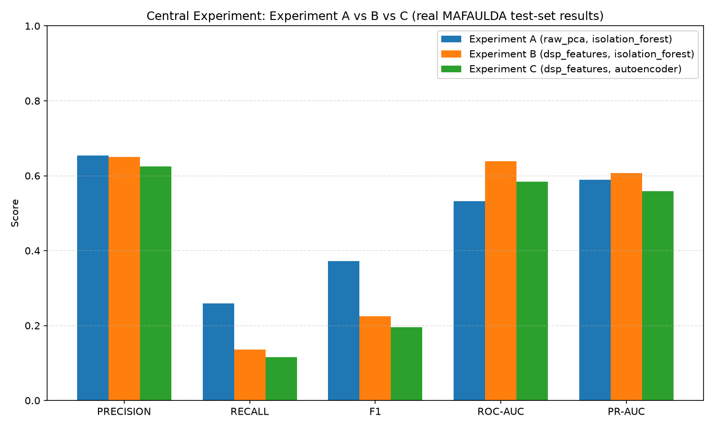

# AI-Powered Vibration Signal Anomaly Detection & Predictive Maintenance

A full-stack platform (FastAPI + React/TypeScript) that applies digital signal processing, classical machine learning, and deep learning to real industrial vibration recordings, to detect abnormal machine behavior and expose the results through an interactive web UI.

---

## Table of Contents

- [Overview](#overview)
- [Architecture](#architecture)
- [Signal Processing](#signal-processing)
- [Machine Learning](#machine-learning)
- [Deep Learning](#deep-learning)
- [Evaluation](#evaluation)
- [Results](#results)
- [Installation](#installation)
- [Usage](#usage)
- [Data Leakage Prevention](#data-leakage-prevention)
- [Future Work](#future-work)
- [Project Structure](#project-structure)
- [License](#license)

---

## Overview

This project analyzes real vibration signals from rotating machinery and flags windows of signal that look statistically unusual compared to a learned "normal" baseline — a common predictive-maintenance task known as **unsupervised anomaly detection**.

- **Dataset:** [MAFAULDA](http://www02.smt.ufrj.br/~offshore/mfs/page_01.html) (Machinery Fault Database) — real multi-channel (8 channels/recording) accelerometer recordings sampled at 50,000 Hz. This project uses 4 of the real, labeled machine states present in the audited subset: `normal`, `imbalance`, `horizontal-misalignment`, `vertical-misalignment` (see [Signal Processing](#signal-processing) and `docs/dataset_audit/`).
- **Models:** an `IsolationForest` (scikit-learn) and a small dense **Autoencoder** (PyTorch), both trained **only on `normal`-labeled data** — this is what makes the approach unsupervised anomaly detection rather than fault classification.
- **Central experiment:** a controlled A/B/C comparison (`docs/results/central_experiment_report.md`) of two input representations (PCA-reduced raw windows vs. hand-engineered DSP features) across both models, evaluated with one shared, model-agnostic metrics function.
- **Cross-dataset validation:** the MAFAULDA-trained models (unmodified) were additionally evaluated on the real, external [CWRU Bearing Dataset](https://engineering.case.edu/bearingdatacenter) (`docs/results/cross_dataset_validation.md`) to test generalization beyond the training dataset.

**What this project is *not*, and what it does not claim:**

> **Anomaly score = how unusual (out-of-distribution) a signal window is relative to the normal behavior the model learned — not a calibrated measure of physical fault severity, and not a probability of failure.**

A score of `0.8` does not mean "80% damaged" or "80% probability of failure." The models have no notion of physical fault severity, remaining useful life, or failure probability — they only measure statistical distance from a learned normal baseline. Multiple real fault classes exist in the training data and are used for **evaluation** (does the score actually separate normal from the different real fault types?) and for **visualization** (a real PCA 3D feature-space plot — see [Usage](#usage)), never as a label the model is trained to predict directly.

---

## Architecture

Real, implemented data flow, backend to frontend:

```text
MAFAULDA CSV files (data/raw/mafaulda/)
        │
        ▼
Dataset loader + validators  (app/datasets/loader.py, validators.py, mafaulda_parser.py)
   - resolves each file's real split (train/validation/test) from data/processed/split_manifest.json
   - validates sampling rate (50,000 Hz) / channel count (8) / minimum length
        │
        ▼
Windowing  (app/signal_processing/windowing.py)
   - segments ONE recording's samples into fixed-size, optionally-overlapping windows
   - never mixes samples from two different recordings into one window
        │
        ▼
Signal preprocessing / DSP  (app/signal_processing/*)
   - detrending, normalization/standardization, Butterworth filtering (filtfilt),
     FFT, Welch PSD, STFT/spectrogram
        │
        ▼
Feature extraction  (app/features/registry.py, extractor.py)
   - 15 real DSP features per window (9 time-domain + 6 frequency-domain)
        │
        ▼
Scaling  (app/ml/scaling.py)
   - StandardScaler, fit on train only, applied (transform-only) to validation/test
        │
        ▼
Models  (app/ml/isolation_forest.py, autoencoder.py, training.py)
   - IsolationForest / Autoencoder, both trained ONLY on normal-labeled train windows
        │
        ▼
Scoring & thresholding  (app/ml/scoring.py, inference.py)
   - raw score → anomaly-oriented score → min-max normalization (validation-fit) → calibrated threshold
        │
        ▼
Evaluation  (app/ml/evaluation.py)
   - one shared, model-agnostic evaluate() — Precision/Recall/F1/ROC-AUC/PR-AUC/confusion matrix/FPR/FNR/inference time
        │
        ▼
FastAPI  (app/main.py, app/api/routes/*)
   - REST endpoints exposing datasets, DSP operations, feature extraction, model predictions, experiment results
        │
        ▼
React + TypeScript frontend  (frontend/src/)
   - Dashboard, Signal Analysis, DSP Lab, Anomaly Detection, Models, Experiments, Dataset pages (Plotly charts)
```

**Backend** (`backend/`): Python 3.13, FastAPI, scikit-learn, PyTorch, pandas/numpy/scipy, SQLAlchemy, pytest. Dependency management via `uv` (`pyproject.toml` + `uv.lock`).

**Frontend** (`frontend/`): React 19 + TypeScript, Vite, Tailwind CSS v4, a shadcn/Base UI-derived component set, `react-plotly.js` for all charts, `react-router` for client-side routing.

**Persistence:** trained model/scaler artifacts are plain files under `models/` (`.pkl` via `joblib`, `.pt` via `torch.save`, plus a JSON metadata sidecar per model — see [Machine Learning](#machine-learning)). Experiment run metadata is stored in SQLite via SQLAlchemy (`app/ml/experiment_registry.py`) — there is no separate `experiments/` folder of loose files.

---

## Signal Processing

All implemented in `backend/app/signal_processing/`:

| Module | Real responsibility |
|---|---|
| `preprocessing.py` | Linear detrending (`scipy.signal.detrend`); min-max normalization and z-score standardization, each with a strict fit-on-train/transform-on-other-splits contract |
| `filtering.py` | Butterworth filtering (`scipy.signal.butter`) applied with **`scipy.signal.filtfilt`** for zero-phase (no phase distortion), configurable `lowpass`/`highpass`/`bandpass` |
| `fft.py` | Single-sided FFT (`numpy.fft.rfft`/`rfftfreq`) and dominant-frequency extraction |
| `psd.py` | Power spectral density via **Welch's method** (`scipy.signal.welch`) |
| `spectrogram.py` | Short-Time Fourier Transform / spectrogram (`scipy.signal.spectrogram`) |
| `windowing.py` | Fixed-size, optionally-overlapping window segmentation, strictly **within one recording** — see [Data Leakage Prevention](#data-leakage-prevention) |

These are exposed directly through the API (`POST /api/fft`, `/api/psd`, `/api/spectrogram`, `/api/dsp/filter`) and through the frontend's **DSP Lab** and **Signal Analysis** pages, so a user can apply/inspect each operation interactively on a real signal, not just read about it.

---

## Machine Learning

### Feature Engineering

`backend/app/features/registry.py` defines exactly **15 real DSP features** per window, computed by `app/features/extractor.py` (`extract_features`/`extract_feature_matrix`):

- **9 time-domain** (`FEATURE_REGISTRY`): `mean, std, variance, rms, peak, peak_to_peak, skewness, kurtosis, crest_factor`
- **6 frequency-domain** (`FREQUENCY_FEATURE_REGISTRY`, derived from one shared Welch PSD per window): `dominant_frequency, spectral_centroid, spectral_bandwidth, spectral_energy, spectral_entropy, band_energy_10_100hz`

The exact feature set is always readable directly from `FEATURE_REGISTRY`/`FREQUENCY_FEATURE_REGISTRY` — it is not duplicated as a hard-coded number anywhere else in the pipeline.

### Feature Scaling

`backend/app/ml/scaling.py`: a single `sklearn.preprocessing.StandardScaler`, fit **exclusively on the train split** (`fit_scaler`) and applied to validation/test via **transform only** (`apply_scaler` — there is deliberately no `fit_transform` helper in this module). The fitted scaler is persisted (`scaler_v1.pkl`) and reused by both models — never refit per model or per split.

### Isolation Forest

`backend/app/ml/isolation_forest.py`:

- `select_normal_samples` filters the train split down to `normal`-labeled windows only.
- `train_isolation_forest` trains `sklearn.ensemble.IsolationForest` **only on that normal-only subset** — the model never sees a labeled fault example during training.
- `score` wraps `IsolationForest.decision_function` (sklearn's own convention: lower = more anomalous).
- Persistence: `joblib`-serialized `models/isolation_forest_v1.pkl` + `scaler_v1.pkl`, with a JSON metadata sidecar (`isolation_forest_v1.json`) recording feature names/dimension, threshold, score direction, dataset/split-manifest hashes, random seed, and creation timestamp — for reproducibility and provenance.
- `random_state=42` (this project's fixed seed); no other hyperparameter (e.g. `n_estimators`, `contamination`) is hard-coded beyond scikit-learn's own defaults, unless explicitly overridden by the caller.

---

## Deep Learning

`backend/app/ml/autoencoder.py` — `Autoencoder(input_dim, hidden_dim, bottleneck_dim)`, a small, fully-configurable dense autoencoder:

- **Encoder:** `Linear(input_dim → hidden_dim) → ReLU → Linear(hidden_dim → bottleneck_dim)`
- **Decoder (symmetric):** `Linear(bottleneck_dim → hidden_dim) → ReLU → Linear(hidden_dim → input_dim)` (no final activation)

`input_dim`/`hidden_dim`/`bottleneck_dim` are constructor parameters, not hard-coded constants — the trained production artifact's real dimensions are recorded in `models/autoencoder_v1.pt` itself (saved alongside the state dict, so the exact architecture can always be reconstructed on load) and its `feature_dimension=15` in `models/autoencoder_v1.json`.

`backend/app/ml/training.py` (`train_autoencoder`):

- **Loss:** `nn.MSELoss()` (mean squared reconstruction error).
- **Optimizer:** `torch.optim.Adam`.
- **Trained only on `normal`-labeled train windows** (same unsupervised contract as Isolation Forest).
- **Early stopping:** tracks validation loss, patience-based (`TrainingConfig(patience=10, min_delta=1e-4)`), restores the best checkpoint's weights at the end — not just the last epoch's.
- Default `TrainingConfig`: `learning_rate=1e-3, batch_size=32, max_epochs=100, seed=42`.
- Reconstruction error (`app/ml/inference.reconstruction_error`, per-sample MSE) is the anomaly score — already "higher = more anomalous," unlike Isolation Forest's `decision_function`, which needs an explicit sign flip (`app/ml/scoring.to_anomaly_score`) to match this project's shared convention.
- Persistence mirrors Isolation Forest: `models/autoencoder_v1.pt` + `autoencoder_v1.json` metadata sidecar with the same provenance fields.

---

## Evaluation

One shared, **model-agnostic** evaluator — `backend/app/ml/evaluation.py::evaluate(y_true, y_pred, anomaly_scores, inference_time)` — used identically for Isolation Forest and Autoencoder (it has no import of, or branch on, either model). Both models are reduced to the same generic contract (binary ground truth, binary prediction, continuous anomaly score, measured inference time) before this function ever sees them, so no separate metric-computation path exists per model.

Metrics returned by every real evaluation in this project:

- **Precision, Recall, F1** — from the binary prediction at the calibrated threshold.
- **ROC-AUC, PR-AUC** — from the continuous anomaly score (threshold-independent).
- **Confusion matrix** — `[[TN, FP], [FN, TP]]`.
- **FPR** (`FP/(FP+TN)`), **FNR** (`FN/(FN+TP)`).
- **Inference time** — wall-clock seconds around the scoring call only.

Mathematically undefined cases (e.g. a single-class test set) are reported as `NaN`, never as a fabricated placeholder value (verified directly against a real single-class CWRU subset — see [Results](#results)).

Threshold calibration (`app/ml/scoring.calibrate`) always uses the **validation split only** — see [Data Leakage Prevention](#data-leakage-prevention).

---

## Results

**Every number in this section is copied from a real, already-generated artifact under `docs/results/`** — nothing here was computed specifically for this README, and nothing is estimated or rounded beyond what the source document itself reports.

### Central experiment (A/B/C) — full report: [`docs/results/central_experiment_report.md`](docs/results/central_experiment_report.md)

Same real MAFAULDA test subset (1,948 windows), same evaluator, for all three:

| Experiment | Representation | Model | Precision | Recall | F1 | ROC-AUC | PR-AUC |
|---|---|---|---:|---:|---:|---:|---:|
| A (`EXP-A-002`) | Raw windows + PCA | Isolation Forest | 0.6537 | 0.2598 | 0.3718 | 0.5322 | 0.5899 |
| B (`EXP-B-001`) | DSP Features (15) | Isolation Forest | 0.6502 | 0.1355 | 0.2243 | 0.6383 | 0.6073 |
| C (`EXP-C-001`) | DSP Features (15) | Autoencoder | 0.6243 | 0.1160 | 0.1957 | 0.5847 | 0.5583 |



The blueprint's hypothesis ("DSP features separate normal/anomaly better than a same-dimensionality raw+PCA representation") is reported as **PARTIALLY SUPPORTED**: DSP features rank better across all thresholds (higher ROC-AUC/PR-AUC), but raw+PCA's specific calibrated operating point scores higher on Precision/Recall/F1 in this run. Full reasoning, limitations, and reproducibility verification (each experiment re-run and diffed against its registered result) are in the linked report.

### Isolation Forest vs. Autoencoder — full report: [`docs/results/isolation_forest_vs_autoencoder.md`](docs/results/isolation_forest_vs_autoencoder.md)

Same DSP-feature test set (1,948 windows: 974 normal / 974 anomaly), both models:

| Metric | Isolation Forest | Autoencoder |
|---|---:|---:|
| Precision | 0.6502 | 0.6243 |
| Recall | 0.1355 | 0.1160 |
| F1 | 0.2243 | 0.1957 |
| ROC-AUC | 0.6383 | 0.5847 |
| PR-AUC | 0.6073 | 0.5583 |
| FPR | 0.0729 | 0.0698 |
| FNR | 0.8645 | 0.8840 |
| Inference time (s, 1948 windows) | 0.0093 | 0.0014 |

**Honest, disclosed limitation shared by every number above:** both models in this specific run were trained on only 2 real normal recordings (the minimal real-data subset established in early development). Recall is low for both (11–14%) — most plausibly a direct consequence of that tiny training subset, not an inherent flaw in either architecture. Neither model is declared "better" overall — Isolation Forest scores modestly higher on 5/7 classification metrics here, while the Autoencoder is 5–10× faster at inference.

### Cross-dataset validation (MAFAULDA → CWRU) — full report: [`docs/results/cross_dataset_validation.md`](docs/results/cross_dataset_validation.md)

The real, standing MAFAULDA-trained models (unmodified — no retraining, refitting, or recalibration on CWRU) were evaluated on the real CWRU Bearing Dataset, grouped by CWRU's own two real sampling rates:

| CWRU group | Windows (normal / anomaly) | Model | Precision | Recall | F1 | ROC-AUC | FPR |
|---|---|---|---:|---:|---:|---:|---:|
| 12,000 Hz | 79,112 (8,512 / 70,600) | Isolation Forest | 0.8924 | 1.0000 | 0.9431 | 0.6124 | **1.0000** |
| 12,000 Hz | 79,112 (8,512 / 70,600) | Autoencoder | 0.8924 | 1.0000 | 0.9431 | 0.6752 | **1.0000** |
| 48,000 Hz | 86,368 (0 / 86,368) | Isolation Forest | 1.0000 | 1.0000 | 1.0000 | `NaN` (single class) | `NaN` |
| 48,000 Hz | 86,368 (0 / 86,368) | Autoencoder | 1.0000 | 1.0000 | 1.0000 | `NaN` (single class) | `NaN` |

**Reported honestly, not softened:** at MAFAULDA's own calibrated threshold, both models flag essentially every CWRU window — normal and faulty alike — as anomalous (FPR = 1.0 at 12 kHz, the only group with real normal examples). The calibrated *decision* does not transfer to CWRU. The underlying continuous scores are not random, however — ROC-AUC (0.61–0.68) is above the 0.50 chance level — see the linked report's full interpretation, including the disclosed caveats (no shared fault type between the two datasets, different sampling rates/window durations, and one inferential step — CWRU's `Normal/` sampling rate — confirmed with the project owner rather than assumed).

---

## Installation

### Prerequisites

- Python **3.13+** (the real backend venv in this repo was created with 3.13.5)
- Node.js (for `npm` — no specific version is pinned in `frontend/package.json`)
- [`uv`](https://docs.astral.sh/uv/) (the backend's real dependency manager — `backend/pyproject.toml` + `backend/uv.lock`)

### Backend

```bash
cd backend
uv sync                 # installs every dependency pinned in pyproject.toml/uv.lock
# or: pip install -e .   (any environment manager that reads pyproject.toml works)

uvicorn app.main:app --reload --port 8000
```

Real backend dependencies (`backend/pyproject.toml`): `fastapi`, `uvicorn`, `pydantic`/`pydantic-settings`, `numpy`, `pandas`, `scipy`, `scikit-learn`, `torch`, `sqlalchemy`, `matplotlib`, `httpx`, `pytest`.

Configuration is read from a `.env` file (see the root [`.env.example`](.env.example)) via `pydantic-settings`, resolved relative to the directory `uvicorn` is started from (i.e. `backend/.env` if started from `backend/`). Every setting has a safe default (`MODEL_DIR`/`DATA_DIR` fall back to this repo's own `models/`/`data/` directories, `CORS_ORIGINS` defaults to `http://localhost:5173`), so **a `.env` file is not strictly required** to run the backend locally.

### Frontend

```bash
cd frontend
npm install
cp .env.example .env    # sets VITE_API_URL=http://localhost:8000 by default
npm run dev
```

Real frontend stack (`frontend/package.json`): React 19, TypeScript, Vite, Tailwind CSS v4, `react-router`, `react-plotly.js`/`plotly.js`.

### Data

The datasets themselves are **not bundled with this repository** (size/licensing) and must be downloaded separately by whoever clones it:

- MAFAULDA → place under `data/raw/mafaulda/` (see `data/processed/split_manifest.json` for the exact real train/validation/test split this project uses: 611/135/134 files).
- CWRU (optional, only needed for cross-dataset validation) → place under `data/external/cwru/` (see `backend/app/datasets/cwru_loader.py`'s own docstring for the required real directory layout).

---

## Usage

With the backend running on `http://localhost:8000` and the frontend on `http://localhost:5173`:

- **`/docs`** (`http://localhost:8000/docs`) — FastAPI's interactive OpenAPI/Swagger UI over every real endpoint below.
- **Dashboard** (`/dashboard`) — overview of trained models and the dataset they were evaluated on.
- **Signal Analysis** (`/signal-analysis`) — time-domain, frequency-domain (FFT), and spectrogram views of a real signal.
- **DSP Lab** (`/dsp-lab`) — interactively apply Butterworth low/high/band-pass filtering to a real signal and inspect the filtered result.
- **Anomaly Detection** (`/anomaly-detection`) — runs the currently-selected model's prediction on a real signal and shows the anomaly score, status, and a feature-deviation-based explanation.
- **Models** (`/models`) — lists the real, persisted model artifacts and their metrics; lets the user pick the active model used elsewhere in the app.
- **Experiments** (`/experiments`) — the real A/B/C central-experiment comparison matrix, plus the real PCA 3D feature-space visualization (colored by real class, with an explicit "not proof of separability" disclaimer — see [Overview](#overview)).
- **Dataset** (`/dataset`) — real dataset summary/detail (signal count, sampling rate, channels, labels).

Real backend REST endpoints (`backend/app/api/routes/`, 15 total, verified directly against the running app's route table):

| Method | Path | Purpose |
|---|---|---|
| GET | `/api/health` | Liveness check |
| GET | `/api/datasets` | List real datasets |
| GET | `/api/datasets/{dataset_id}` | Real dataset detail |
| POST | `/api/fft` | Compute FFT of a submitted signal |
| POST | `/api/psd` | Compute Welch PSD |
| POST | `/api/spectrogram` | Compute STFT/spectrogram |
| POST | `/api/dsp/filter` | Apply Butterworth filtering |
| POST | `/api/features/extract` | Extract the 15 real DSP features |
| GET | `/api/models` | List real, persisted models + metrics |
| GET | `/api/models/{model_id}/performance` | Real per-model metrics |
| GET | `/api/models/sample-signal` | A real sample signal for demo/inference |
| POST | `/api/models/predict` | Run a real model prediction (anomaly score + explanation) |
| GET | `/api/experiments` | The real A/B/C experiment matrix |
| GET | `/api/experiments/{experiment_id}` | Real per-experiment reproducibility detail |
| GET | `/api/experiments/pca-visualization` | Real per-window PCA coordinates + real class labels |

**Note on the "Signals" page:** the sidebar includes a `/signals` route (`Signals.tsx`), but as of this writing it is a placeholder (`"Signals page"`) with no real functionality — it is not described further here since there is nothing implemented yet to document.

### Tests

```bash
cd backend
pytest        # runs the full real test suite (testpaths=["tests"] in pyproject.toml)
```

There is no frontend test script (`frontend/package.json` defines only `dev`, `build`, `lint`, `preview` — no `test`).

---

## Data Leakage Prevention

This section documents the concrete, implemented rules that keep this project's metrics honest — not aspirational goals.

### Dataset split

Train/validation/test assignment happens **per recording file** (`data/processed/split_manifest.json`), **before** any windowing occurs. A recording assigned to `train` never contributes any window to `validation` or `test`, and vice versa — this is enforced structurally: `app/datasets/loader.py` resolves a file's split from the manifest once, and every window later derived from that file (`app/signal_processing/windowing.create_windows`) carries that same split label, copied, never re-derived.

### Windowing

`create_windows` operates on **exactly one recording's values at a time** — there is no code path that accepts multiple recordings and concatenates them before segmenting. Overlap between windows (e.g. 50%) is applied only *within* a single recording's own windows, never across a boundary that would mix samples from two different recordings (or two different splits) into one window.

### Scaling

`app/ml/scaling.py`'s `StandardScaler` is fit (`fit_scaler`) **exclusively on the train split**. Validation and test features are only ever passed through `apply_scaler` (transform-only) — the module deliberately has no `fit_transform` convenience function, so there is no easy path to accidentally re-fit on validation/test data.

### PCA (Raw+PCA representation, Experiment A)

`app/ml/dimensionality.py`'s `fit_pca` is called only on the train split; validation/test/any other data is passed through the already-fitted `transform_pca`, which never re-fits. The same fitted PCA object is reused (never re-fit) when this representation is later applied to entirely different data — e.g. the CWRU cross-dataset evaluation's projection reuses Experiment A's PCA transformer unchanged.

### Isolation Forest

`train_isolation_forest` trains only on the subset of train windows labeled `normal` (`select_normal_samples`) — no fault-labeled window is ever part of its training data.

### Autoencoder

`train_autoencoder` trains only on `normal`-labeled train windows — the same unsupervised contract as Isolation Forest, enforced by the training function's own input contract, not by convention alone.

### Threshold

`app/ml/scoring.calibrate`/`calibrate_threshold` compute the anomaly-decision threshold **exclusively from the validation split's scores** (`fit_score_normalizer`, `calibrate_threshold` — neither function accepts a `test_scores`/`test_labels` argument anywhere in their signature, making it structurally impossible to pass test data into calibration through this API). The test split is never used to choose or adjust the threshold.

### Evaluation

The test split is used **only** for the final, reported metrics (`app/ml/evaluation.evaluate`) — never to select a threshold, a hyperparameter, or a model. Every real evaluation reproduced in this project (see [Results](#results)) recomputes validation-only calibration fresh and verifies it reproduces whatever threshold was already persisted, rather than silently trusting a stored value.

---

## Future Work

The following are genuinely **not implemented** — listed here as ideas for future development, not as existing functionality:

- **Improve cross-dataset generalization.** The real CWRU evaluation ([Results](#results)) shows the MAFAULDA-calibrated decision threshold does not transfer; recalibrating score normalization (without retraining the model itself) on a target dataset's own distribution is an open, unexplored question.
- **Additional real datasets** beyond MAFAULDA/CWRU (e.g. NASA IMS, considered and explicitly deferred during initial planning — see `docs/blueprint.md`).
- **Hyperparameter tuning** for both Isolation Forest and the Autoencoder — the current artifacts use fixed, documented defaults, not a tuned search.
- **Larger real training subsets.** Several real results in this project ([Results](#results)) are limited by a small (2-recording) real training subset used throughout early development; retraining on this project's full ~611-recording real train split is a natural next step.
- **More advanced explainability** beyond the current feature-deviation-based explanation (`app/services/explanation_service.py`) — e.g. SHAP/LIME-style attributions.
- **Deployment / MLOps**: containerization (Docker), CI/CD, model monitoring/drift detection, a production-grade database (this project currently uses SQLite for experiment metadata) — none of this exists yet; local development (`uvicorn` + `vite dev`) is the only supported mode today.
- **Additional models** beyond Isolation Forest and Autoencoder (e.g. One-Class SVM, a different deep architecture).

---

## Project Structure

```text
/
├── backend/            # FastAPI app, DSP/ML/DL pipeline, pytest suite
│   ├── app/
│   ├── scripts/         # real experiment-runner scripts (run_experiment_a/b/c, run_cross_dataset_validation, ...)
│   └── tests/
├── frontend/            # React + TypeScript + Vite app
├── data/
│   ├── raw/              # MAFAULDA (gitignored — not bundled)
│   ├── processed/        # split_manifest.json and other derived, committed metadata
│   └── external/          # CWRU (gitignored — not bundled)
├── models/              # persisted model/scaler artifacts (.pkl/.pt + .json metadata sidecars)
├── docs/
│   ├── blueprint.md      # original project design/decision document
│   ├── backlog.md         # phase/task backlog
│   ├── dataset_audit/      # real dataset structure audit (TASK 1.5.x)
│   └── results/            # real, generated experiment/evaluation reports (source of truth for Results)
├── notebooks/           # reserved, currently empty (no notebooks committed yet)
├── scripts/             # reserved, currently empty — the real, active scripts live under backend/scripts/
├── .env.example
├── .gitignore
└── README.md
```

---

## License

MIT — see [LICENSE](LICENSE).
